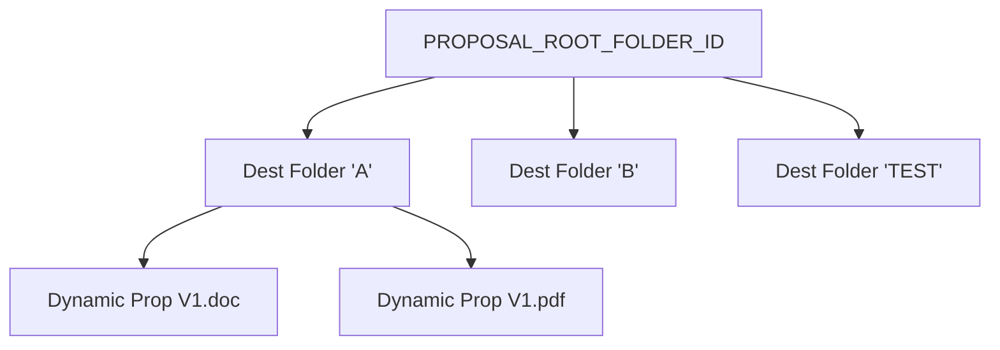

# Proposal AppsScript Workflow Inventory

Authoritative Source:
i:\My Drive\AI Assist\HVAC\AI\Antigravity\Changeout Pricing\script_changeout_v16.47_2026_09_22_0556.gs

Source Version:
v16.47

Verification Date:
2026-09-29

## 1. Executive Summary
A stateless Apps Script backend architecture parsing POST payloads and dynamically generating single-execution Google Docs and PDFs matching simple naming conventions. Currently entirely lacking cross-request identifiers, persistent configuration metadata, or active state storage.

## 2. Current Request Routing
**Location**: `doPost(e)` (approx line 1859-1893)
**Responsibility**: 
Intercepts external POST web events, mapping the native `JSON.parse(e.postData.contents)` properties against specific action queries:
- `action === 'getProposalFolders'` → executes `getProposalFolders()`
- `action === 'createProposalExport'` → executes `createProposalExport(payload)`
- Triggers standard error JSON handling via `jsonResponse()` wrapper payloads upon unknown matches.

## 3. createProposalExport Flow
**Location**: `createProposalExport(payload)` (approx line 1967-2034)
**Validation**: Requests strict presentation of `destinationFolderId`, `proposalDate`, `customerName`, `address`, `proposalText`. Intercepts missing ZIPs natively via regex extraction `/\b(\d{5})(?:-\d{4})?\b/` against the address string. Re-verifies Target Folder safety via `validateProposalDestinationFolder(id)`. 
**Sanitization**: Parses fields individually through `sanitizeProposalFilenamePart()`. 

## 4. Google Doc Creation
**Filename Assembly**: Strings combine via `${safeDate} - ${safeCustomer} - Proposal V${nextVersion}`. `getNextProposalVersion()` counts existing iterations inside the bounds. 
**Output Location**: Directly into the targeted `destinationFolder`.
**Behavior**: Copies arbitrary explicit reference `PROPOSAL_TEMPLATE_ID`. Replaces explicit syntax `\{\{PROPOSAL_CONTENT\}\}` inside the `.getBody()`. 
**Output Parameters**: Known `docId` intrinsically natively returned as JSON parameter.

## 5. PDF Creation
**Generation Mechanism**: Calls native Apps Script `completedDocFile.getAs(MimeType.PDF)`. 
**Rules**: Mirrored perfectly against the cloned `.doc` structural naming arrays alongside the `.pdf` extension block.
**Execution Risks**: Stored equivalently in exactly the target destination folder. Collision bypassed strictly due to the fact that `getNextProposalVersion()` sequentially shifts `V1` parameters into higher integers mapping regex strings inherently avoiding 1:1 filename overlaps organically! 

## 6. Destination Folder Architecture
**Mechanism**: `getProposalFolders()` (approx line 1895-1916).
**Hierarchy Details**: Hardcodes search beneath a solitary `PROPOSAL_ROOT_FOLDER_ID`. Dynamically iterates solely one native level explicitly mapping children parameters bypassing intrinsic sub-tier depths.
**Mapping Structure**: Returns explicit native Drive array pairings `{id, name}` to dynamically build Retest's UI, while validating dynamically submitted downstream jobs backwards uniquely via `validateProposalDestinationFolder()`.



## 7. Filename Rules
**Method**: `sanitizeProposalFilenamePart()` (approx line 1932-1940). 
Strips ASCII parameters, illegal `/:*?` system flags, and truncates trailing array whitespaces.
- **Base Stem Element**: `[Date] - [Customer] - Proposal V`
- **Output Form**: `[Date] - [Customer] - Proposal V[X].pdf`
- **Actual Code Output**: `2026-09-28 - Dawson - Proposal V1.pdf`

## 8. Existing Persistent Storage
**Conclusion**: **NONE**. The backend completely isolates execution constraints away from `.json` objects, persistent `PropertiesService`, custom document metadata headers, or database indexing layers. Completely context stateless outside standard output artifacts. 

## 9. Current Response to Retest
Returns the following payload schema natively:
```json
{
    "success": true,
    "baseName": "2026-09-28 - Dawson - Proposal V1",
    "version": 1,
    "docId": "DriveID1",
    "googleDocUrl": "https://docs.google.com/...",
    "pdfFileId": "DriveID2",
    "pdfUrl": "https://docs.google.com/..."
}
```
Retest visually reports Version output and URL maps directly into interactive anchors, but explicitly **fails** to natively record `docId` tracking boundaries anywhere persistently, inherently destroying downstream connection threads locally. 

## 10. Cross-Device Proposal Identity Analysis
Given native execution completely unbinds state, introducing a UUID binding string into Retest payload mapping is inherently required. The true Proposal Identity must map independent of file-name representations (since subsequent user renaming behaviors crash active references uniquely). A unified manifest file or document-stored Property map acts as the mandatory linkage constraint to cross-device access logic. 

## 11. Builder State Storage Options
1. **JSON Drive Sidecar (Recommended)**: Direct `DriveApp.createFile('manifest.json')` matching exact proposal GUIDs. Bypasses file-size limit exceptions intrinsic to standard Metadata properties, natively serializes state easily, perfectly organizes inside target destination folders. 
2. **Document Properties**: Attaches exact constraints dynamically against `.pdf` properties arrays, inherently avoiding separate directory footprints completely, but scales poorly against complex nested state variables.
3. **Index Spreadsheet**: Highly manageable query interface, single DB layer constraints, natively scaling simple ID matching rules. However, represents massive asynchronous bottleneck constraints under simultaneous network executions. 

## 12. Load Proposal Requirements
Requires a dedicated Web App listener hook (e.g. `action: getProposalState`). The caller defines an explicitly identified `proposalId`. The GAS retrieves JSON payloads, parses raw blocks, and fires direct JS representation mappings downwards directly to `window.loadProposalState(payload)` where parsing algorithms reconstruct `proposalAppState` natively bridging active user states.

## 13. Update / Revision Requirements
Refactoring execution constraints from purely dynamic V[x] generation into isolated file manipulation flows requires native App Script implementation mapping of: 
- `DriveApp` `moveTo()` actions executing File movement routing historical states into local `\Archive` directories gracefully.
- Explicit renaming scripts dropping specific `_vX` strings targeting specifically superseded output elements uniquely prioritizing native Root logic arrays tracking the core string names natively. 

## 14. Revision Diff Support
Maintaining purely recursive JSON block architecture organically grants total text-independent evaluation scopes. Abstracting explicit tree logic easily calculates dynamic variable jumps structurally independent of presentation format logic parameters. 

## 15. Risks / Failure Modes
- **Orphan Templates**: While `createProposalExport` explicitly includes garbage collection routines `docFile.setTrashed(true)` on generation errors inside the try/catch loop, nested API timeouts risk ghost artifacts inherently persisting visually against the database array layers natively. 
- **Duplication Locks**: Dynamic indexing iterates simple matching arrays looking sequentially against `V[X]` patterns natively. Multi-device racing environments scaling sequential strings inherently invite execution crossover crashes completely overriding PDF representations uniquely in 0-lock network execution boundaries.
- **Accidental Archive Failures**: Lacking explicit File ID parameters dynamically isolates file movement scripts to fragile string-matching mechanisms inviting false-positive replacements actively overriding arbitrary outputs natively.

## 16. Existing Code That Can Be Reused
- `sanitizeProposalFilenamePart(value)` string stripping methodologies natively bypass local formatting issues automatically. 
- Extracted Payload mapping constraints logically dictate the required input properties structurally inherently ensuring clean user integration endpoints dynamically.
- Existing REST request architecture accurately abstracts JSON responses effortlessly without requiring external dependencies natively.

## 17. New Backend Capabilities That Would Be Required
- File ID tracking Database schemas/Manifest payloads natively isolated explicitly from textual parsing implementations.
- Active Google File renaming/Movement scripts interacting directly across explicit native File arrays actively mapping destination directory tracking schemas dynamically.
- `JSON.stringify` serialization mappings explicitly decoding recursive Javascript arrays properly escaping arbitrary presentation inputs statically without syntax collapse routines internally tracking state representation correctly.

## 18. Recommended Architecture Options
Adopt a unified JSON File manifest standard tied dynamically to the active `DriveApp` folder structurally encoding exact matching GUID elements inside independent sidecar architectures seamlessly providing robust storage properties independent of active native Google Doc limitations universally resolving recursive data requirements properly escaping standard PDF constraint layers fundamentally. 

## 19. Recommended Next Step
Develop isolated AppScript prototype endpoints initiating dedicated `Sidecar JSON Storage` mappings checking Google Drive API stability tracking arbitrary GUID configurations testing sequential updating performance before integrating explicitly against core Builder logic natively. 

## CURRENT vs REQUIRED

| Capability | Current Architecture | Required Architecture |
| :--- | :--- | :--- |
| **Persistent Proposal State Tracking** | None - Stateless | GUID-tracked JSON states (`Sidecar`/`Metadata`) |
| **Active Cross-Device File Access** | Ignored completely | Isolated API hook `getProposalState(GUID)` returning exact JSON |
| **Target Proposal Updating Constraints** | Increments String versions dynamically (`V1/2/3`) | Explicit MoveTo() Archive folders updating `Current` naming rules exactly |
| **Ghost Artifact Safety Locks** | Local catch exceptions (`setTrashed`) | Dedicated backend sequence mappings explicitly validating end-to-end processing execution strictly |
| **Output Data Caching** | Ignored completely natively | Tracks `docId`, `pdfId` parameters strictly against manifest mappings properly indexing structural tracking elements dynamically |
